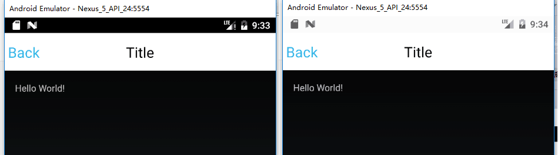
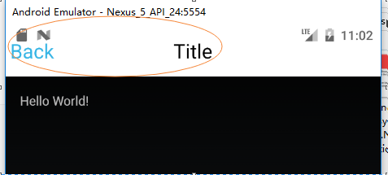
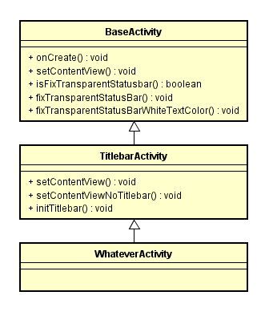
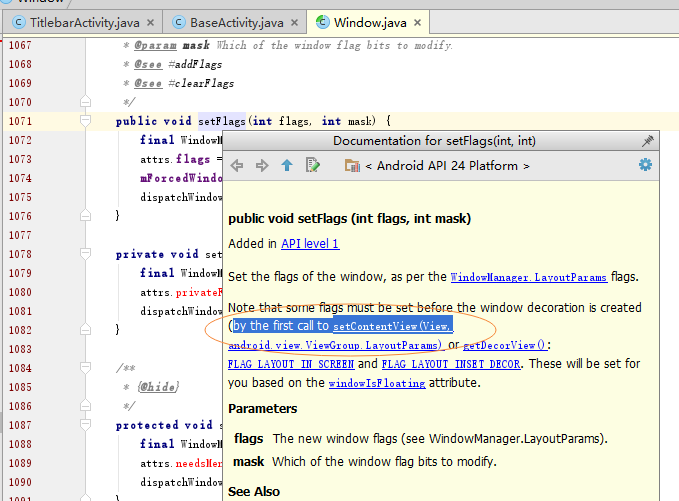
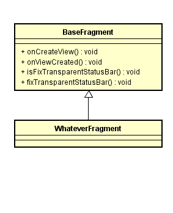
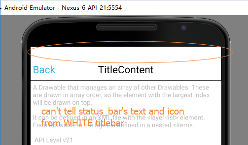
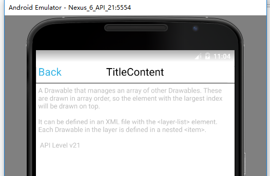
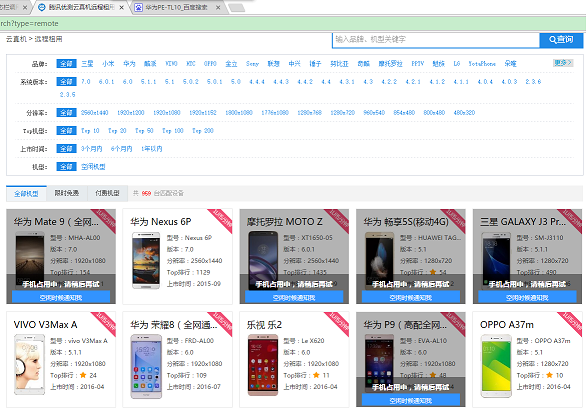

【Android】透明状态栏在App中的实现与接口设计

GitHub源码:[TransparentStatusbar](https://github.com/sodino/TransparentStatusBar)  
源码中分两个app
* TestBasic:
  1. 透明状态栏实现的示例,方便debug   
  2. 白色/红色Titlebar的不同处理方式   
  3. `paddingTop`与`fitsSystemWindows`的对比  
  4. `layer-list`分层背景的使用  
  
* TitlebarBelowTransparentStatusBar   
  1. 示例App中统一的处理方式
  2. Activity中的接口设计
  3. Fragment中的接口设计


--------------------------------
## 认识透明状态栏

从`Android4.4`开始引入了透明状态栏的新特性．
见下图，左边为传统的`Android`系统状态栏，右边为透明状态栏．　　　
　


* 正常显示状态栏的图标/文字　　
* 状态栏的背景是透明的，能透出应用的背景色．而不像之前一样是默认的黑色不可编辑．


--------------------------------
## 透明状态栏Api及特性

从`Android 4.4(v19)`开始，透明状态栏特性变化很频繁，直到`Android 6.0(v23)`才真正完善稳定．　　
　  
下表展示各版本所引入的新`Api`或特性．

|Version/level|Features |Description |
|:----|:---|:---| 
| 4.4/v19|WindowManager.LayoutParams.FLAG_TRANSLUCENT_STATUS|状态栏是渐变色的半透明|　　
| 4.4_Watch/v20|OnApplyWindowInsetsListener|能够区分多个Inset事件与Rect信息(PS.系统状态栏属于插入区Inset的一种)|
| 5.0/v21|WindowManager.LayoutParams.FLAG_DRAWS_SYSTEM_BAR_BACKGROUNDS<br/>View.SYSTEM_UI_FLAG_LAYOUT_FULLSCREEN<br/>View.SYSTEM_UI_FLAG_LAYOUT_STABLE|允许自定义状态栏背景色了，但无法控制状态栏上的文字/图标颜色|
| 6.0/v23|View.SYSTEM_UI_FLAG_LIGHT_STATUS_BAR|状态栏上的图标/文字颜色的亮色模式，即颜色是暗色|


--------------------------------
## 设置透明状态栏

根据多个版本间的`Api`及特性,`Java`代码如下:  
````
// Activity.java
// onCreate(Bundle bundle)
   
            if (Build.VERSION.SDK_INT >= Build.VERSION_CODES.LOLLIPOP) {
                // Android 5.0   
                int visibility = View.SYSTEM_UI_FLAG_LAYOUT_FULLSCREEN | View.SYSTEM_UI_FLAG_LAYOUT_STABLE;   
                if (Build.VERSION.SDK_INT >= Build.VERSION_CODES.M) {
                    // Android 6.0   
                    // 亮色模式,避免系统状态栏的图标不可见   
                    // visibility |= View.SYSTEM_UI_FLAG_LIGHT_STATUS_BAR;   
                }   
                window.getDecorView().setSystemUiVisibility(visibility);   
                window.addFlags(WindowManager.LayoutParams.FLAG_DRAWS_SYSTEM_BAR_BACKGROUNDS);
                // 自定义状态栏背景色   
                window.setStatusBarColor(Color.TRANSPARENT);   
            } else if (Build.VERSION.SDK_INT >= Build.VERSION_CODES.KITKAT) {
                // Android 4.4   
                window.addFlags(WindowManager.LayoutParams.FLAG_TRANSLUCENT_STATUS);   
            }   
````

> **注意：** 要设置透明状态栏的`Activity`其`theme`须是`NoTitleBar`.  
````
// AndroidManifest.xml   
     <activity android:name="MyActivity"   
                android:theme="@android:style/Theme.NoTitleBar"  
            />  
    // Or / 或       
    // MyActivity.java
    public void onCreate(Bundle bundle) {  
        super.onCreate(bundle);  
        requestWindowFeature(Window.FEATURE_NO_TITLE);  
    }
````

代码执行后,界面显示效果如下图:      
  
可以发现系统状态栏的区域已经消失,`Activity`的**contentView顶上去**占据了原来属于系统状态栏的区域.     
导致虽然`Back` `Title`虽然仍在`Titlebar`区域垂直居中,但视觉效果上受状态栏图标的影响,却不是垂直居中的效果.      

所以接下来第二步就是: 以何种方式处理消失的系统状态栏区域?

-------------------------------------
## 处理消失的系统状态栏区域 
处理方式可以有:    
1. 就让`activity`的`contentView`顶上去吧,不需要修改.
    * 这种场景用于一些可全屏浏览图片/观看视频等界面.     
2. 调整`Titlebar`的高度.  
    * 可以通过设置`paddingTop`/`layout_height`.
    * 对于不同的Android版本,可以通过版本适配文件,在`values/dimens.xml`和`values-v19/dimens.xml`分别定义具体数值.
    * 调整`paddingTop`,有可能导致`Titlebar`中的内容不会再垂直居中.
    * 不适应无`Titlebar`的`activity`.   
3. `android:fitsSystemWindows` && `OnApplyWindowInsetsListener`
    * `fitsSystemWindows`标签可以直接对`View`添加`paddingXXX`  
    * 从`activity`的布局嵌套结构中只对**第一个**设置`fitsSystemWidnows`的`View`有效,无法设置设置到多个`View`
    * 方式单一,对于指定的界面实现简单,但要应用于整个`App`超多`Activity`的`layout.xml`,不够灵活.
    * 不够灵活还表现在:有些`activity`的复杂效果可能会有多个`View`同时或分场合占据系统状态栏的空间,需要留出额外的修改接口.            
4. 在`activity`的`contentView`的顶部再`addView`直接填充原来状态栏的区域.   
5. `OnApplyWindowInsetsListener`可以回调给开发者当前WindowInset的区域类型与区域宽高Rect信息   
    * 和`fitsSystemWindows`一样,多个`View`设置该监听但也只有最外层的view会被调用执行.   


在实践中,本人采用了`1` `2` `5`这三种方式配合使用.   


--------------------------------
## fitsSystemWindows   

我并不想用该属性.   
这里只记录一下系统源码中的相应的方法:  
````
View.java
  public WindowInsets dispatchApplyWindowInsets(WindowInsets insets)
  private boolean fitSystemWindowsInt(Rect insets)
  
  // 这个方法是真正为View添加paddingXXX的地方
  protected void internalSetPadding(int left, int top, int right, int bottom)
  
````

调试系统源码的一个方法:
使用`Android`自带模拟器`Debug`,断点跟进执行过程.要注意,模拟器的`apk level`要和`compileSdkVersion`及`buildToolsVersion`相对应.  

--------------------------------
##  Activity中的接口设计

接口设计的原则:  
1. 对正常的业务布局xml的编写没有强制要求  
   如不要求强制使用`fitsSystemWindows`  
2. 不影响正常的业务Activity的java代码编写  
   如业务Actiivty不需要额外的编码量即可实现透明状态栏效果.特殊的动效Activity除外.    
3. 提供灵活的处理方式
   可方便的开启或关闭透明状态栏功能.    
   


类图如下:   
  

* `BaseActivity` 是`App`中所有`Activity`的父类.  
  由于透明状态栏与`Activity`相关,所以对应的接口声明都放在`BaseActivity`中.  
  默认`Activity`的透明状态栏功能是开启的.  
  该类中几个重要函数的调用顺序为: 
    
```    
     `onCreate` → `setContentView` → `isFixTransparentStatusbar`   
                                              └──true→ `fixTransparentStatusbar`   

```

具体代码实现为:   
````
// WhateverActivity.java  
    @Override  
    protected void onCreate(Bundle savedInstanceState) {  
        super.onCreate(savedInstanceState);  
        setContentView(R.layout.activity_main);  
    }  

// BaseActivity.java  
    @Override  
    public void setContentView(View view) {  
        rootView = view;  
        super.setContentView(view);  
  
        if (isFixTransparentStatusBar()) {  
            Window window = getWindow();  
            if (Build.VERSION.SDK_INT >= Build.VERSION_CODES.LOLLIPOP) {  
                int visibility = View.SYSTEM_UI_FLAG_LAYOUT_FULLSCREEN | View.SYSTEM_UI_FLAG_LAYOUT_STABLE;  
                if (Build.VERSION.SDK_INT >= Build.VERSION_CODES.M) {  
                    // 亮色模式,避免系统状态栏的图标不可见
                    visibility |= View.SYSTEM_UI_FLAG_LIGHT_STATUS_BAR;
                }  
                window.getDecorView().setSystemUiVisibility(visibility);  
                window.addFlags(WindowManager.LayoutParams.FLAG_DRAWS_SYSTEM_BAR_BACKGROUNDS);  
                window.setStatusBarColor(Color.TRANSPARENT);  
  
                fixTransparentStatusBar(view);  
                // 最后fix一下状态栏背景白色与系统的文字图标白色的问题  
                fixTransparentStatusBarWhiteTextColor(view, viewStatusbarBackground);  
            } else if (Build.VERSION.SDK_INT >= Build.VERSION_CODES.KITKAT) {  
//                WindowManager.LayoutParams localLayoutParams = window.getAttributes();  
//                localLayoutParams.flags = (WindowManager.LayoutParams.FLAG_TRANSLUCENT_STATUS | localLayoutParams.flags);  
                window.addFlags(WindowManager.LayoutParams.FLAG_TRANSLUCENT_STATUS);  
 
                fixTransparentStatusBar(view); 
                // 最后fix一下状态栏背景白色与系统的文字图标白色的问题  
                fixTransparentStatusBarWhiteTextColor(view, viewStatusbarBackground);  
            } else {  
                setStatusbarBackgroundGone();  
            }  
        } else {   
            setStatusbarBackgroundGone();  
        }  
    }  
````


  > **注意** : 由于透明状态栏是执行`Window.addFlags()`实现的,该方法又调用了`Window.setFlags()`.  
  > 阅读该`Api`文档,发现推荐先执行`setContentView`后执行`Window.setFlags()`.    
  >  
  
  

* `TitlebarActivity` 是通用的包含`Titlebar`的`Activity`.   
  重载了`setContentView()`,实现自动添加`Titlebar`这个通用组件,当然不需要`Titlebar`时也可以使用`setContentViewNoTitlebar()`.
  扩展此功能,即在添加通用`Titlebar`前先添加上通用的`viewStatusbarBackground`.  
  `setContentView()`的实现为:  
  
````
    @Override
    public void setContentView(View view) {  
        contentView = view;  
   
        LinearLayout linearLayout = new LinearLayout(this);  
        linearLayout.setOrientation(LinearLayout.VERTICAL);  
  
        LayoutInflater.from(this).inflate(R.layout.transparent_status_bar_bg_view, linearLayout, true);  
        viewStatusbarBackground = linearLayout.findViewById(R.id.status_bar_background);  
  
        LayoutInflater.from(this).inflate(R.layout.titlebar_original, linearLayout, true);  
        viewTitlebar = linearLayout.findViewById(R.id.titlebar_layout);  
  
        initTitlebarIDs(viewTitlebar);  
  
        linearLayout.addView(contentView, new LinearLayout.LayoutParams(LinearLayout.LayoutParams.MATCH_PARENT, LinearLayout.LayoutParams.MATCH_PARENT));  
  
        super.setContentView(linearLayout);  
    }  
````

其中,为了便于定位到`Titlebar`及`viewStatusbarBackground`,这两个组件的`id`都被预先定义在`attrs.xml`中.  

````
// values/attrs.xml
<resources>
    <item name="status_bar_background" type="id"/>
    <item name="titlebar_layout" type="id"/>
</resources>
````

--------------------------------
##  Fragment中的接口设计

有的`Activity`的显示主体是`Fragment`,接口设计的观点为不应干扰`Fragment`正常的`onCreateView()`的实现流程.  
那么在哪个时机处理`Fragment`的`contentView`呢?  
阅读`Api`发现了`Fragment::onViewCreated(View view)`这个方法,该方法会在`onCreateView()`返回后,立即执行,且方法参数为`onCreateView()`所返回的`View`.  



Java代码实现如下:  

````
public class BaseFragment extends Fragment {
    @Override
    public void onViewCreated(View view, Bundle savedInstanceState) {
        if (Build.VERSION.SDK_INT >= Build.VERSION_CODES.KITKAT
                && isFixTransparentStatusBar()) {
            fixTransparentStatusBar(view);
        }

        super.onViewCreated(view, savedInstanceState);
    }


    /**
     * 是否需要改变status bar背景色，对于某些机型手机（如oppo）无法改变状态栏字体颜色，
     * 会被当前状态栏挡住字体颜色，因此修改透明状态栏背景色
     * @return true: 调用fixTransparentStatusBar()
     */
    protected boolean isFixTransparentStatusBar(){
        return false;
    }

    /**
     * @param view {@link #onCreateView(LayoutInflater, ViewGroup, Bundle)}中返回的view．
     * */
    protected void fixTransparentStatusBar(View view) {

    }
}

````

通过`fixTransparentStatusBar()`,即可以调整`Fragment`的界面显示,无论是往状态栏区域添加一个填充`View`或根据`id`再调整宽高或`padding`都是可以的.  


--------------------------------
## 白色`Titlebar`的处理  

`Android 6.0`及以上可以使用亮色模式.     
但在是低版本的手机中,`Titlebar`如果是白色的,或者说`App`的主题是白色的,则会出现状态栏的白色文字和图标被淹没在`Titlebar`中无法阅读.如下图:   
  
这时可以通过`layer-list`来设置分层背景,不必新增额外的`View`填充系统状态栏区域.    
见如下代码或`TestBasic/res/drawable/title_layout_white3.xml`:   

````
<?xml version="1.0" encoding="utf-8"?>
<layer-list xmlns:android="http://schemas.android.com/apk/res/android">
    <item>
        <shape android:shape="rectangle">
            <solid android:color="@android:color/black" />
        </shape>
    </item>
    <item android:bottom="1dp">
        <shape android:shape="rectangle">
            <solid
                android:color="@android:color/white" />
        </shape>
    </item>

    <!-- 48dp为标题栏高度　-->
    <item android:bottom="48dp">
        <shape xmlns:android="http://schemas.android.com/apk/res/android"
            android:shape="rectangle">
            <gradient
                android:startColor="@android:color/white"
                android:centerColor="@color/middleColor"
                android:endColor="@android:color/darker_gray"
                android:angle="90"
                />
        </shape>
    </item>
</layer-list>
````

* 第一个`item`为黑色背景,效果为`Titlebar`底下的黑色分隔线.  
* 第二个`item`为常规的`Titlebar`背景.  
* 第三个`item`为状态栏的过滤渐变背景色.   

最张效果见下图:  



--------------------------------
## 小米 与 魅族 与 (莫名其妙的)华为 

小米 与 魅族都能通过自各的反射方法实现状态栏的亮色模式,解决白色`Titlebar`的问题.  
这点两家做得很好.这里直接给出官方文档说明了.      

[小米状态栏变色](http://dev.xiaomi.com/docs/appsmarket/technical_docs/immersion/)   
[魅族状态栏变色](http://open-wiki.flyme.cn/index.php?title=%E7%8A%B6%E6%80%81%E6%A0%8F%E5%8F%98%E8%89%B2)

上述的代码也整合进了GitHub中的工程`TitlebarBelowTransparentStatusBar`.   


至于华为,额...大部分华为机子都是好机,但**华为荣耀6 Plus(PE-TL10,EMUI3.1,Android 5.1.1)**明明是Android 5.1,但使用5.1的代码无效,得使用4.4的实现方式.    

--------------------------------
## 腾讯优测UTest 

一个方便使用的App远程测试平台,机型多,Android版本齐全.      
出了华为这档子事,就把App上传试了下其它各种手机,还好还好,没发现其它妖娥子.    




